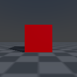

.. _installation:

Installation
==================

.. highlight:: python

SAPIEN is distributed via `PyPI <https://pypi.org/project/sapien/>`_.

Currently supported Python versions:

* Python 3.7, 3.8, 3.9, 3.10, 3.11

Supported operating systems:

* Linux: Ubuntu 18.04+, Centos 7+, Arch

System requirements:

* Rendering: NVIDIA or AMD GPU
* Ray tracing: NVIDIA RTX GPU or AMD equivalent
* Denoising: NVIDIA RTX GPU

Software requirements:

* Ray tracing: NVIDIA Driver >= 470
* Denoising: NVIDIA Driver >= 522 (earlier version may work but is not officially supported)

Pip(PyPI) or Conda
-----------------------

.. code-block:: shell

  pip install sapien

.. note::
   ``pip >= 19.3`` is required for installation. Upgrade pip with

  .. code-block:: shell

     pip install -U pip

Build from source
-----------------------

You may build SAPIEN from source to access latest features under development in
the `dev <https://github.com/haosulab/SAPIEN/tree/dev>`_ branch, and/or
contribute to the project.

Clone SAPIEN
^^^^^^^^^^^^^^^^^^^^^^
.. code-block:: shell

   git clone --recursive https://github.com/haosulab/SAPIEN.git

Build in Docker
^^^^^^^^^^^^^^^^^^^^^^

While it is possible to build SAPIEN natively on Linux. We strongly recommend
building using `Docker <https://docs.docker.com/get-started/overview/>`_.

PhysX is currently built against ``107.3-physx-5.6.1``. GPU-enabled builds
require a CUDA toolkit and driver stack compatible with CUDA ``>= 12.8``.

.. code-block:: shell

   cd SAPIEN
   ./scripts/docker_build_wheels.sh

.. note::

   ``scripts/docker_build_wheels.sh`` builds all supported wheel variants by
   default. Pass an explicit Python ABI such as ``310`` or ``311`` to build a
   single wheel.

.. note::

   To verify against a local PhysX SDK instead of downloading it through
   CMake, set ``SAPIEN_PHYSX5_DIR`` to the extracted CPU SDK root and set
   ``SAPIEN_PHYSX5_GPU_DIR`` to the extracted GPU SDK root before invoking the
   build script. The Docker helper forwards these environment variables into the
   container.

   .. code-block:: shell

      export SAPIEN_PHYSX5_DIR=/path/to/physxcpu-linux-clang
      export SAPIEN_PHYSX5_GPU_DIR=/path/to/physxgpu-linux-clang
      ./scripts/docker_build_wheels.sh 310

.. note::

   Building may fail if you have previously built SAPIEN with Docker due to an
   update to the Docker image. Pull the latest Docker image with

   .. code-block:: shell

      docker pull fxiangucsd/sapien-build-env

Build without Docker
^^^^^^^^^^^^^^^^^^^^^^

Native builds should use the same PhysX and CUDA toolchain versions as the
Docker image.

.. code-block:: shell

   export CUDA_PATH=/usr/local/cuda-12.8
   export SAPIEN_PHYSX5_DIR=/path/to/physxcpu-linux-clang
   export SAPIEN_PHYSX5_GPU_DIR=/path/to/physxgpu-linux-clang
   python setup.py bdist_wheel --build-dir=sapien_build

Verify Installation
-----------------------

Server (no display)
^^^^^^^^^^^^^^^^^^^^^^^
.. warning::

   This script will generate ``output.png`` at the current working directory.

You may test the offscreen rendering of SAPIEN with the following command

.. code-block:: shell

   python -m sapien.example.offscreen

On a server without display. It may generate errors about the display. You can
ignore these warnings.

If SAPIEN is installed properly. The following image will be generated at the
current working directory, named ``output.png``.

Desktop (with display)
^^^^^^^^^^^^^^^^^^^^^^^

You may test the onscreen rendering of SAPIEN with the following command

.. code-block:: shell

   python -m sapien.example.hello_world

This command should open a viewer window showing a red cube on the ground.
You can learn more about this scene in :ref:`hello_world`.

.. note::

   During the PhysX 5.6.1 migration, the PhysX-specific Python verification
   suite passes with ``python -m unittest discover -s test_physx -p 'test_*.py'``
   from the ``unittest`` directory. The monolithic C++ ``sapien_test`` target
   is currently blocked by unrelated renderer test API drift in
   ``test/sapien_renderer/material.cpp`` and
   ``test/sapien_renderer/texture.cpp``.
