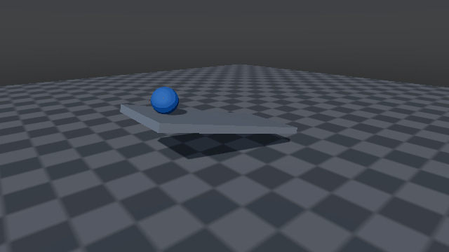

.. _physics:

Physics
==================

.. highlight:: python

This section describes the current PhysX-facing Python API for configuring a
scene and changing rigid-body properties.

In this tutorial, you will learn how to:

* configure global PhysX defaults before creating a scene;
* assign ``PhysxMaterial`` objects to collision shapes;
* create kinematic bodies;
* set damping and velocities on rigid components;
* read pose and velocity from entities and components.

Configure default PhysX properties
-------------------------------------

PhysX defaults are configured through ``sapien.physx`` before the scene/system is
created. ``PhysxSceneConfig`` controls scene-level settings such as gravity,
CCD, TGS, CPU worker count, and GPU broadphase environment-id bits. Default
contact material is configured separately.

.. code-block:: python

   import sapien

   scene_config = sapien.physx.PhysxSceneConfig()
   scene_config.gravity = [0, 0, -9.81]
   scene_config.enable_ccd = True
   sapien.physx.set_scene_config(scene_config)

   sapien.physx.set_default_material(
      static_friction=0.5,
      dynamic_friction=0.5,
      restitution=0.0,
   )

   scene = sapien.Scene()
   scene.set_timestep(1 / 240)

``sapien.SceneConfig`` is kept as an alias of ``sapien.physx.PhysxSceneConfig``
for compatibility, but new code should use the ``sapien.physx`` namespace.

Set physical materials
-------------------------------------

``sapien.physx.PhysxMaterial`` stores contact friction and restitution. Pass it
to collision-shape builder methods.

.. code-block:: python

   slippery = sapien.physx.PhysxMaterial(
      static_friction=0.05,
      dynamic_friction=0.03,
      restitution=0.0,
   )

   builder = scene.create_actor_builder()
   builder.add_sphere_collision(radius=0.2, material=slippery, density=500)
   builder.add_sphere_visual(radius=0.2, material=[0.2, 0.4, 1.0])
   ball = builder.build(name="slippery_ball")

Density, patch radius, minimum patch radius, contact offset, rest offset, and
collision groups live on collision shapes, not on the render material.

Create a kinematic body
-------------------------------------

Kinematic bodies are dynamic PhysX bodies whose motion is driven by the user
rather than by forces. Use ``build_kinematic`` or set the builder body type to
``"kinematic"``.

.. code-block:: python

   builder = scene.create_actor_builder()
   builder.add_box_collision(half_size=[1.0, 0.5, 0.05])
   builder.add_box_visual(half_size=[1.0, 0.5, 0.05], material=[0.6, 0.6, 0.6])
   slope = builder.build_kinematic(name="slope")
   slope.set_pose(sapien.Pose([0, 0, 0.5]))

   slope_body = slope.find_component_by_type(sapien.physx.PhysxRigidDynamicComponent)
   slope_body.set_kinematic_target(sapien.Pose([0.1, 0, 0.5]))

For static world geometry that never moves, prefer ``build_static``.

Set damping and velocities
-------------------------------------

Actor-builder damping fields are applied when the PhysX component is created.
You can also edit the component after building.

.. code-block:: python

   builder = scene.create_actor_builder()
   builder.linear_damping = 0.1
   builder.angular_damping = 0.05
   builder.add_box_collision(half_size=[0.2, 0.2, 0.2])
   body_entity = builder.build(name="damped_box")

   body = body_entity.find_component_by_type(sapien.physx.PhysxRigidDynamicComponent)
   body.set_linear_velocity([0, 1, 0])
   body.set_angular_velocity([0, 0, 2])

Read kinematic quantities
------------------------------------------------------------

The world pose belongs to the entity. Linear and angular velocity belong to the
rigid body component.

.. code-block:: python

   pose = body_entity.get_pose()
   linear_velocity = body.get_linear_velocity()
   angular_velocity = body.get_angular_velocity()

   print(pose.p, pose.q)  # quaternion order is wxyz
   print(linear_velocity, angular_velocity)
